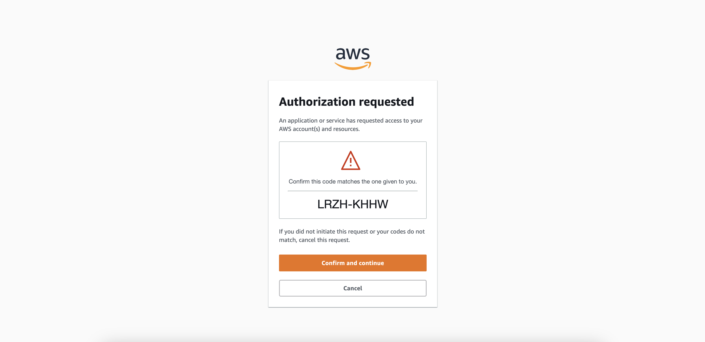

## AWS Get Credentials
---
#### Description:

A python script allows you to get AWS Credentials programmatically by running `aws sso login` command and printing out the profile name to export and be able to run `AWS CLI` commands in your terminal

This is helpfull if you need to get the aws credentials to run scripts or any aws cli command from your terminal.

##### Authors:
> Gabriel De La Rosa Gamboa
>

##### Prerequisites:
- Python 3.x
- AWS Account ID
- have setup aws Accounts Profiles in `~/.aws/config` file like below example
```
[sso-session test_session]
sso_start_url = https://blabla.awsapps.com/start#
sso_region = us-east-1
sso_registration_scopes = sso:account:access

[profile any_profile_name]
sso_session = test_session
sso_account_id = XXXXXXXXXXXX
sso_role_name = PowerUsers
region = us-east-1
output = json
```
##### How to use:
- Run below command in terminal:
`python3 aws_sso_get_credentials.py XXXXXXXXXXXX` This will open a browser session for you to validate the CODE like below screenshot



- Confirm the CODE and allow the access


- From the output of the script get the last line and export the profile by running the export command
```
Exported AWS_PROFILE: any_profile_name
Attempting to automatically open the SSO authorization page in your default browser.
If the browser does not open or you wish to use a different device to authorize this request, open the following URL:

https://device.sso.us-east-1.amazonaws.com/

Then enter the code:

BMDM-BCNZ
Successfully logged into Start URL: https://blablabla.awsapps.com/start#
AWS credentials test successful:
{
    "UserId": "AXXYYYXXZZZWWWNNNSSAAA:name",
    "Account": "XXXXXXXXXXXX",
    "Arn": "arn:aws:sts::XXXXXXXXXXXX:assumed-role/AWSReservedSSO_PowerUserAccess_7cc12r446cfb0/name"
}


To maintain the AWS session export the profile to bash environment variables

by Running below command:

export AWS_PROFILE=any_profile_name
```
- Now you would be able to run any aws commands using the `AWS CLI`
